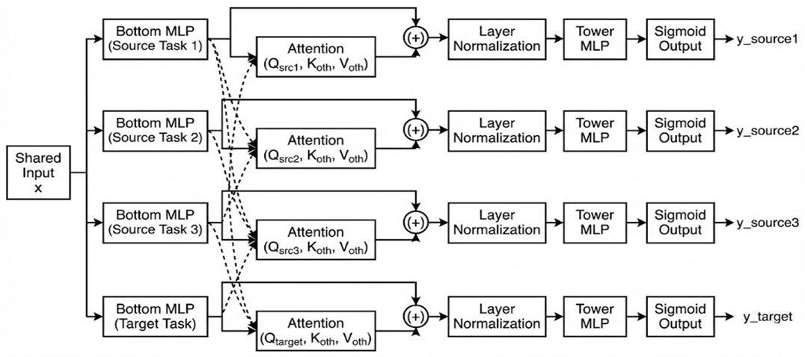

<div align="center">

# IPO Adjustment Risk Prediction

**Cross-Attention 기반 병렬 Multi-Task Learning을 활용한<br>IPO 상장 초기 가격 발견 완료 시점(T=22) 이후 시장 대비 성과 방향 예측**

**조영서 · 이경민**

DB Insurance & Finance Contest

</div>

## Overview

국내 IPO 시장에서 상장 초기 과열 이후 발생하는 단기 가격 조정 위험을 규명하고, 가격 발견 완료 시점 이후 시장 대비 성과 방향을 예측하기 위해 Cross-Attention 기반 병렬 Multi-Task Learning 모형을 제안한다.

2009년 6월부터 2025년까지 KOSPI 및 KOSDAQ 시장에 신규 상장된 **923개 기업**의 BHAR(누적보유초과수익률)을 분석한 결과, 평균 BHAR 변화율이 안정화되는 상장 후 **약 22거래일**을 가격 발견 완료 시점으로 식별하였다.

## Key Idea

IPO 성과는 초기 수요 충격 → 단기 조정 → 수급 변화에 따른 재평가로 이어지는 **비선형 가격 동학**을 보이지만, 이를 유발하는 수요 강도와 기업 특성이라는 근본 요인은 시점 간 공유된다. 이 구조를 활용하기 위해 서로 다른 시점의 성과를 보조 과제(Source Task)로 설정하고, Cross-Attention을 통해 시점 간 정보를 적응적으로 전이하는 병렬 MTL 구조를 설계하였다.

### Source Task Selection

Information Gain 기반 Greedy Selection과 베이지안 최적화를 통해 다음 세 시점을 보조 과제로 선정하였다:

|   Source Task   |   시점   | 경제적 의미                                   |
| :-------------: | :------: | :-------------------------------------------- |
|  **T=1**  |  상장일  | 초기 수요 충격 (투자 심리, 수급 불균형)       |
| **T=68** | 약 3개월 | 보호예수 해제에 따른 수급 전환 및 가격 재평가 |
| **T=149** | 약 7개월 | 락업 영향 소화 후 중기 가격 정착              |

### Model Architecture

<p align="center">
  
</p>

기존 MTL 구조인 MMoE와 PLE는 입력 의존적 게이팅을 통한 간접적 정보 병합에 의존하며, AITM은 순차적 제약이 IPO의 비단조적 가격 경로와 충돌하는 한계가 있다. 제안 모델은 이러한 제약을 배제하고, Cross-Attention 기반의 **병렬적 정보 전이(Parallel Transfer)** 구조를 설계하여 과제 간 직접적인 상호 참조와 선택적 정보 결합을 가능하게 하였다.

각 Task의 고유 표현(Bottom MLP 출력)이 Query가 되고, 자신을 제외한 나머지 전체 Task의 표현이 Key/Value가 되어 Multi-Head Cross-Attention을 수행한다. Attention 출력은 Residual Connection을 통해 원본 표현과 합산된 후 Layer Normalization을 거쳐 최종 Task Representation을 생성하며, 각 Tower MLP를 통해 예측 확률을 산출한다.

## Results

### Benchmark Comparison (5-Seed Average)

<div align="center">

| MTL |     Model     |    Accuracy    |    Precision    | Recall |       F1       |       AUC       |
| :-: | :------------: | :-------------: | :-------------: | :----: | :-------------: | :-------------: |
| ✓ | **Ours** | **65.42** | **47.92** | 54.21 | **50.85** | **59.21** |
| ✓ |      PLE      |      64.21      |      46.85      | 51.20 |      48.92      |      57.80      |
| ✓ |      MMoE      |      63.42      |      46.99      | 42.19 |      38.42      |      51.82      |
| ✓ |      AITM      |      57.02      |      39.70      | 55.78 |      40.96      |      51.88      |
|    |    XGBoost    |      49.86      |      37.65      | 81.41 |      49.93      |      54.97      |
|    |    CatBoost    |      53.44      |      37.88      | 67.52 |      46.68      |      52.54      |
|    | Logistic Reg. |      56.47      |      36.40      | 59.31 |      44.73      |      53.94      |
|    |   SingleTask   |      63.47      |      45.66      | 38.75 |      35.61      |      51.40      |

</div>

### Statistical Significance (McNemar's Test)

<div align="center">

|  vs Model  | χ² (p-value) | Significance |
| :--------: | :------------: | :----------: |
|    AITM    | 9.452 (0.002) |    ★★★    |
|  XGBoost  | 9.124 (0.003) |    ★★★    |
| SingleTask | 6.210 (0.013) |     ★★     |
|    PLE    | 4.125 (0.042) |     ★★     |

</div>

### SHAP Feature Importance

IPO 단기 성과를 결정하는 핵심 요인은 **초기 수요/수급 충격**과 **재무 효율성**으로 수렴:

<div align="center">

| 순위 | 변수             | 의미                         |
| :--: | :--------------- | :--------------------------- |
|  1  | 개인청약 경쟁률  | 투자자 수요 과열 지표        |
|  2  | 의무보유확약     | 유통 물량 제약 (수급 안정성) |
|  3  | 총자산회전율     | 자산 활용 효율성             |
|  4  | 영업활동현금흐름 | 실질적 현금 창출 능력        |
|  5  | 기관경쟁률       | 기관 투자자 수요             |

</div>

## Project Structure

```
ipo/
├── main.py                    # 통합 실행 스크립트
├── scripts/
│   ├── crawl.py               # IPO 크롤링
│   ├── bhar_trend.py          # BHAR 추세 계산
│   ├── preprocess.py          # 데이터 전처리
│   ├── source_tasks.py        # Source Task 최적화 + 선정
│   ├── shap_analysis.py       # SHAP 기반 피처 선택 (RFE)
│   ├── optuna_search.py       # Optuna 하이퍼파라미터 탐색
│   ├── train_evaluate.py      # 모델 학습 및 벤치마크
│   └── attention_analysis.py  # Attention 전이 메커니즘 분석
├── src/
│   ├── config.py              # 전역 설정
│   ├── utils.py               # 유틸리티
│   ├── data_pipeline.py       # 데이터 로드/분할/전처리 파이프라인
│   ├── source_selection.py    # Source Task 선정 로직
│   ├── models/
│   │   ├── aitm.py            # Cross-Attention 병렬 MTL (제안 모델)
│   │   ├── mmoe.py            # MMoE
│   │   ├── ple.py             # PLE
│   │   ├── singletask.py      # SingleTask
│   │   └── ml_baselines.py    # XGBoost, CatBoost, Logistic Regression
│   └── crawlers/              # 데이터 수집 모듈
├── data/                      # 원본 데이터
└── output/                    # 실행 결과물 (모델, 시각화 등)
```

## Getting Started

```bash
pip install -r requirements.txt
```

<div align="center">

| 단계 | 명령어                         | 설명                      |
| :--: | :----------------------------- | :------------------------ |
|  1  | `python main.py crawl`       | IPO 크롤링 (OpenDART)     |
|  2  | `python main.py bhar`        | BHAR 추세 계산            |
|  3  | `python main.py preprocess`  | 데이터 전처리             |
|  4  | `python main.py source_task` | Source Task 최적화 + 선정 |
|  5  | `python main.py shap`        | SHAP 기반 피처 선택 (RFE) |
|  6  | `python main.py optuna`      | 하이퍼파라미터 탐색       |
|  7  | `python main.py benchmark`   | 모델 학습 및 벤치마크     |

</div>

## Configuration

모든 실험 설정은 `src/config.py`에서 관리된다.

<div align="center">

| 항목                        |      설정값      | 설명                         |
| :-------------------------- | :--------------: | :--------------------------- |
| `PREDICTION_HORIZON`      |        22        | 가격 발견 완료 시점 (거래일) |
| `MTL_MANUAL_SOURCE_TASKS` | `[1, 68, 149]` | Source Task 시점             |
| `SCALER`                  |  `'standard'`  | StandardScaler 적용          |

</div>
